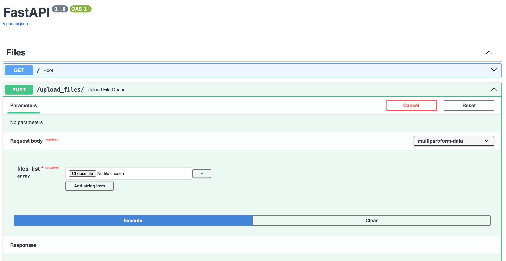
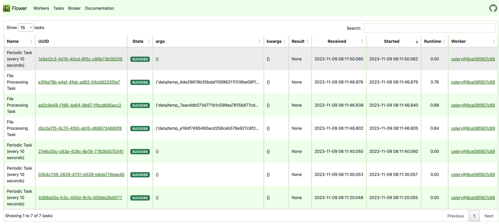

# FastApi-Celery-Flower

Example of implementations a simple FastApi app with Celery tasks and Flower UI.

## Endpoints

- `/`: Hello world endpoint
- `/upload_files`: Upload files endpoint

## Celery tasks

1. `task that handles the upload of files`
2. `task that starts periodically and sends a message to the broker every 10 seconds`

## Docker-compose configuration

- `app`: FastApi app - Web server
- `celery_worker`: Celery worker - Celery task executor
- `flower`: Flower UI - Celery monitoring tool
- `redis`: Redis broker - Celery message broker

## Project structure
- `controllers/*`: Contains the FastApi logic for each endpoint
- `views/*`: Contains the FastApi endpoints
- `data/*`: Contains the test data files
- `celery_worker.py`: Contains the Celery tasks
- `main.py`: Contains the FastApi app entrypoint
- `requirements.txt`: Contains the Python dependencies
- `Dockerfile`: Contains the Docker configuration for the FastApi app
- `docker-compose.yml`: Contains the Docker-compose configuration for the project

## How to run the project

1. Clone the repository
2. Install docker and docker-compose
3. Run `docker-compose up --build`
4. Open http://0.0.0.0:8888/docs in your browser to see the Swagger UI
5. Open http://0.0.0.0:5556/ in your browser to see the Flower UI

## Warning
**Notice that .env file is included in the repository for testing purposes only. In a real project, it should be added to .gitignore.**

## Swagger UI

## Flower UI

